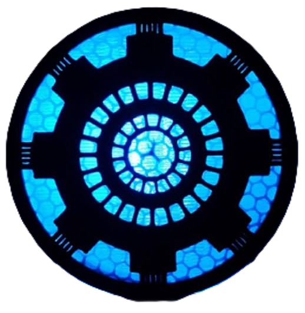
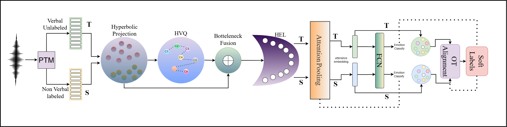

# NOVA-ARC: Prosody as Supervision

### Bridging the Non-Verbal--Verbal for Multilingual Speech Emotion Recognition

<p align="center">
  
</p>

<p align="center">
  <a href="https://2026.aclweb.org/"></a>
  <a href="#citation"></a>
  
  
  
</p>

---

> **Accepted at ACL 2026 (Main)**
>
> *Girish\*, Mohd Mujtaba Akhtar\*, Muskaan Singh*  
> (\* Equal Contribution)

---

## Overview

**NOVA-ARC** (**N**On-**V**erbal to **V**erbal **A**daptation via hyperbolic **A**lignment, **R**adial calibration, and **C**odebook tokens) is a geometry-aware framework for low-resource multilingual Speech Emotion Recognition (SER).

The key insight: **non-verbal vocalizations** (laughter, sighs, cries) express emotion through pure paralinguistic acoustics — independent of language. NOVA-ARC treats multilingual SER as an *unsupervised non-verbal to verbal transfer* problem:

- **Source**: labeled non-verbal vocalizations (NVV)
- **Target**: unlabeled verbal speech across multiple languages

No target-language emotion labels are needed at training time.

<p align="center">
  
</p>

---

## Key Contributions

- **New formulation** for multilingual SER: use labeled non-verbal expressions as supervision and adapt to unlabeled verbal speech without any target emotion labels.
- **NOVA-ARC framework** combining:
  - Hyperbolic Poincare ball geometry for hierarchical affective structure
  - HVQ prosody codebook for discrete paralinguistic tokens
  - Hyperbolic Emotion Lens (HEL) for intensity calibration across domains
  - Optimal transport prototype alignment for unsupervised adaptation
- **First end-to-end** framework to formulate low-resource multilingual SER as unsupervised transfer from labeled non-verbal to unlabeled verbal speech.
- Consistently outperforms Euclidean counterparts and strong SSL baselines across 6 datasets and 4 encoders.

---

## Architecture

```
Your Features  (B, T, input_dim)   <- you extract these however you like
     |
     v
Linear Projection  ->  expmap0  ->  Poincare Ball
     |   hyperbolic frame embeddings  {x_t}
     v
HVQ Prosody Codebook          <-  Poincare distance assignment
     |   discrete tokens  {q_t}        +  straight-through gradient
     v
Mobius Addition  (x_t + q_t)   <-  continuous + discrete fusion
     |   bottleneck embeddings  {b_t}
     v
Hyperbolic Emotion Lens (HEL)  <-  r -> r^alpha  radial calibration
     |   calibrated embeddings  {b_tilde_t}
     v
Hyperbolic Attention Pooling   <-  logmap0 -> weighted sum -> expmap0
     |   utterance embedding  u  (B, d)
     v
Linear Classifier  ->  softmax  ->  emotion prediction

-----------  Domain Adaptation (target domain)  -----------

Source prototypes  (Frechet mean per class)
     +  target utterances
     v
Sinkhorn Optimal Transport  ->  soft pseudo-labels
     v
L_total = L_S  +  lambda_OPT * L_OPT  +  lambda_CE * L_OT-CE
```

---

## Results

### Cross-corpus Adaptation -- NOVA-ARC (Table 3)

Trained on **ASVP-ESD (non-verbal)** as labelled source, evaluated on verbal targets.

| Target Dataset | Language | voc2vec (EUC) | **voc2vec (HYP)** | WavLM (HYP) | MMS (HYP) |
|:---|:---:|:---:|:---:|:---:|:---:|
| ASVP-ESD (V) | English | 87.31 | **92.40** | 91.03 | 89.43 |
| MESD | Spanish | 84.58 | **90.67** | 81.09 | 86.79 |
| AESDD | Greek | 79.63 | **84.39** | 82.98 | 82.03 |
| RAVDESS | English | 87.04 | **93.79** | 92.47 | 89.51 |
| Emo-DB | German | 86.71 | **92.46** | 91.26 | 88.11 |
| CREMA-D | English | 85.26 | **91.32** | 90.76 | 87.94 |

*Accuracy (%) reported. EUC = Euclidean baseline, HYP = NOVA-ARC hyperbolic.*

### Ablation Study (Table 4)

Source: ASVP-ESD (NVV) -- Target: ASVP-ESD (Verbal), voc2vec features.

| Configuration | Accuracy | Macro-F1 |
|:---|:---:|:---:|
| Euclidean geometry | 87.31 | 85.06 |
| No VQ codebook (continuous only) | 74.22 | 70.43 |
| Token only (discrete only) | 76.90 | 73.18 |
| Concat/MLP instead of Mobius fusion | 65.36 | 62.24 |
| No HEL | 72.75 | 51.44 |
| Euclidean OT | 80.24 | 75.64 |
| Adversarial DA | 53.49 | 43.76 |
| OT-UDA baseline | 50.78 | 41.33 |
| **NOVA-ARC (full)** | **92.40** | **89.79** |

---

## Installation

```bash
git clone https://github.com/girish281003/NOVA-ARC.git
cd NOVA-ARC
pip install -r requirements.txt
```

Or install as a pip package:

```bash
pip install -e .
```

**Requirements:** Python 3.8+, PyTorch 2.0+, scikit-learn

---

## How It Works

NOVA-ARC does **not** handle feature extraction. You extract frame-level features from your audio using any tool you like, then hand them to the model. This keeps the library completely independent of any specific encoder or framework.

```
Your audio
    |
    v  (your code — WavLM, librosa, openSMILE, anything)
Frame features  (B, T, D)
    |
    v  (NOVA-ARC takes over from here)
Poincare ball projection -> HVQ Codebook -> HEL -> Pooling -> Classifier
```

---

## Quick Start

### Step 1 -- Extract features with any tool

```python
# Example A: WavLM via HuggingFace
from transformers import WavLMModel
import torch

wavlm = WavLMModel.from_pretrained("microsoft/wavlm-base-plus")
with torch.no_grad():
    features = wavlm(waveforms).last_hidden_state  # (B, T, 768)

# Example B: wav2vec 2.0
from transformers import Wav2Vec2Model
w2v = Wav2Vec2Model.from_pretrained("facebook/wav2vec2-base")
with torch.no_grad():
    features = w2v(waveforms).last_hidden_state    # (B, T, 768)

# Example C: librosa MFCCs  (your own pipeline)
import librosa, numpy as np
mfcc = librosa.feature.mfcc(y=audio, sr=16000, n_mfcc=40)  # (40, T)
features = torch.tensor(mfcc.T).unsqueeze(0)                # (1, T, 40)

# Example D: any other features -- shape must be (B, T, D)
features = your_feature_extractor(audio)
```

### Step 2 -- Build DataLoaders

```python
from torch.utils.data import Dataset, DataLoader
import torch

class EmotionDataset(Dataset):
    """
    Your dataset returns (features, label).
      features : (T, input_dim)   pre-extracted frame features
      label    : int              class index 0 ... num_classes-1
                                  (use -1 for unlabelled target data)
    """
    def __init__(self, features, labels):
        self.features = features   # list or tensor of (T, D) arrays
        self.labels   = labels     # list of ints

    def __len__(self):
        return len(self.features)

    def __getitem__(self, idx):
        return self.features[idx], self.labels[idx]

source_loader = DataLoader(EmotionDataset(src_feats, src_labels), batch_size=16, shuffle=True)
target_loader = DataLoader(EmotionDataset(tgt_feats, [-1]*len(tgt_feats)), batch_size=16, shuffle=True)
test_loader   = DataLoader(EmotionDataset(tst_feats, tst_labels), batch_size=16, shuffle=False)
```

### Step 3 -- Configure and build the model

```python
from nova_arc import NOVAARC, NOVAARCConfig

config = NOVAARCConfig(
    num_classes = 5,     # your number of classes
    input_dim   = 768,   # dimension of your features (must match Step 1)
)

model = NOVAARC(config)
```

### Step 4 -- Train

```python
# With domain adaptation (source labelled NVV + target unlabelled verbal)
model.fit(source_loader, target_loader)

# Source-only (no target domain)
model.fit(source_loader)
```

### Step 5 -- Evaluate and predict

```python
metrics = model.evaluate(test_loader)
print(metrics)
# {"accuracy": 0.924, "weighted_f1": 0.897}

preds = model.predict(test_loader)   # (N,) int64 class indices
```

### Step 6 -- Save and reload

```python
model.save("checkpoints/nova_arc.pt")

model = NOVAARC.load("checkpoints/nova_arc.pt")
model = NOVAARC.load("checkpoints/nova_arc.pt", map_location="cuda")
```

---

## Configuration Reference

`NOVAARCConfig` controls every aspect of the model. Only `num_classes` and `input_dim` are required.

```python
from nova_arc import NOVAARCConfig

config = NOVAARCConfig(
    # --- Required -------------------------------------------
    num_classes = 5,          # number of emotion classes
    input_dim   = 768,        # dimension of your input features

    # --- Architecture toggles --------------------------------
    use_hyperbolic  = True,   # False -> pure Euclidean pipeline
    use_codebook    = True,   # False -> skip HVQ prosody codebook
    use_hel         = True,   # False -> skip Hyperbolic Emotion Lens
    use_ot          = True,   # False -> source-only (no target_loader needed)
    pooling         = "attention",  # "attention" | "mean" | "max"

    # --- Geometry -------------------------------------------
    hidden_dim  = 256,        # internal Poincare ball dimension d
    curvature   = 1.0,        # ball curvature c  (kappa = -c)

    # --- HVQ Codebook ----------------------------------------
    codebook_size      = 256,
    commitment_weight  = 0.25,
    vq_loss_weight     = 1.0,

    # --- Optimal Transport -----------------------------------
    sinkhorn_eps    = 0.05,
    sinkhorn_iters  = 50,
    lambda_opt      = 1.0,    # weight on L_OPT
    lambda_ce       = 1.0,    # weight on L_OT-CE

    # --- Training -------------------------------------------
    lr      = 1e-4,
    epochs  = 30,
    device  = "cuda",         # "cuda" | "cpu" | "mps"
)
```

### Common configurations

```python
# Full NOVA-ARC  (paper setting)
NOVAARCConfig(num_classes=5, input_dim=768)

# Euclidean baseline  (no hyperbolic, no OT)
NOVAARCConfig(num_classes=5, input_dim=768, use_hyperbolic=False, use_ot=False)

# Hyperbolic, source-only  (no domain adaptation)
NOVAARCConfig(num_classes=5, input_dim=768, use_ot=False)

# Ablate HEL
NOVAARCConfig(num_classes=5, input_dim=768, use_hel=False)

# Ablate codebook
NOVAARCConfig(num_classes=5, input_dim=768, use_codebook=False)

# Mean pooling instead of attention
NOVAARCConfig(num_classes=5, input_dim=768, pooling="mean")

# 7 classes, MFCCs input, small model
NOVAARCConfig(num_classes=7, input_dim=40, hidden_dim=128, codebook_size=64)
```

---

## Hyperparameters

| Hyperparameter | Value |
|:---|:---|
| Hyperbolic curvature | k = -1.0 |
| Hyperbolic latent dim | d = 256 |
| Bottleneck dim | d_b = 128 |
| VQ codebook size | K = 256 |
| VQ commitment weight | beta = 0.25 |
| HEL exponent (init) | alpha = 1.0 (learned) |
| OT regularisation | eps_OT = 0.05 |
| Sinkhorn iterations | 50 |
| Optimizer | AdamW |
| LR (new layers) | 1e-4 |
| Weight decay | 0.01 |
| Gradient clipping | 1.0 |
| Epochs | 30 |
| Schedule | 10% warmup + cosine decay |
| Batch size | 16 |
| Prototype refresh | once per epoch |

---

## Repository Structure

```
NOVA-ARC/
|
+-- nova_arc/
|   +-- __init__.py          Public API  (NOVAARC, NOVAARCConfig)
|   +-- hyperbolic.py        Poincare ball math: expmap, logmap, Mobius, Frechet mean
|   +-- codebook.py          Hyperbolic VQ codebook
|   +-- emotion_lens.py      Hyperbolic Emotion Lens (HEL)
|   +-- pooling.py           Hyperbolic attention pooling
|   +-- prototypes.py        PrototypeBank (Frechet mean, epoch refresh)
|   +-- transport.py         Sinkhorn OT + soft pseudo-labels
|   +-- losses.py            L_S, L_OPT, L_OT-CE combined loss
|   +-- model.py             NOVAARC + NOVAARCConfig  (fit/evaluate/predict/save/load)
|   +-- encoders.py          Optional SSL encoder wrappers (WavLM, wav2vec2, voc2vec, MMS)
|
+-- configs/
|   +-- default.yaml         All hyperparameters
|
+-- examples/
|   +-- quick_start.py       Full usage walkthrough
|
+-- test.py                  End-to-end test with synthetic features (no downloads)
+-- index.html               Paper website
+-- setup.py
+-- requirements.txt
```

---

## Datasets

| Dataset | Language | Type | Role |
|:---|:---:|:---|:---|
| [ASVP-ESD](https://www.kaggle.com/datasets/dejolilandry/asvpesdall) | English | NVV + Verbal | Source (NVV split) / Target (Verbal split) |
| [MESD](https://data.mendeley.com/datasets/cy34mh68j9) | Spanish | Verbal | Target |
| [AESDD](http://m3c.web.auth.gr/research/aesdd-speech-emotion-recognition/) | Greek | Verbal | Target |
| [RAVDESS](https://zenodo.org/record/1188976) | English | Verbal | Target |
| [Emo-DB](http://emodb.bilderbar.info/docu/) | German | Verbal | Target |
| [CREMA-D](https://github.com/CheyneyComputerScience/CREMA-D) | English | Verbal | Target |

All datasets standardised to: **happy · anger · disgust · sadness · fear**

---

## Run the Test

Self-contained test using synthetic features — no dataset or model downloads needed:

```bash
python test.py
```

What it prints:
- Per-epoch loss breakdown: `L_S`, `L_OPT`, `L_OT_CE`
- Labelled test-set: accuracy, weighted F1, macro F1, per-class report
- Unlabelled target-domain: predicted class distribution, confidence, OT weights, entropy
- Checkpoint save + reload verification

---

## Citation

If you use NOVA-ARC in your research, please cite:

```bibtex
@inproceedings{girish2026novarc,
  title     = {Prosody as Supervision: Bridging the Non-Verbal--Verbal
               for Multilingual Speech Emotion Recognition},
  author    = {Girish and Akhtar, Mohd Mujtaba and Singh, Muskaan},
  booktitle = {Proceedings of the 64th Annual Meeting of the Association
               for Computational Linguistics (ACL 2026)},
  year      = {2026},
}
```

---

## License

This project is licensed under the MIT License.

---

<p align="center">
  <b>ACL 2026</b> &nbsp;&middot;&nbsp;
  Girish* &nbsp;&middot;&nbsp;
  Mohd Mujtaba Akhtar* &nbsp;&middot;&nbsp;
  Muskaan Singh
  <br/>
  <i>* Equal Contribution</i>
</p>
